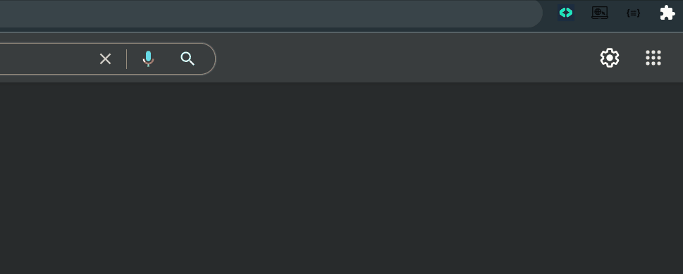

# POTD Google Chrome Extension
[](https://github.com/Hack-Repository/POTD-GoogleChromeExtension "Repo Maintained")
[](https://github.com/Hack-Repository/ "github.com/Hack-Repository")
[](https://github.com/Hack-Repository/POTD-GoogleChromeExtension "POTD")
[](https://github.com/Hack-Repository/POTD-GoogleChromeExtension/issues) 

A Google Chrome Browser extension to provide a daily practice problem on Data Structures and algorithms.

> Beta Release: **[Download and add to Chrome](https://github.com/Hack-Repository/POTD-UI/blob/main/README.md#Beta-Installation "Download from Github")**

## About 
* For individuals preparing for forthcoming software engineering interviews, the extension gives a new interview coding exercise every day.
* The problems are from a curated selection of important DSA interview questions that were hand-picked from existing lists also including **Striver's SDE Sheet**, **450 DSA Sheet**, and many more.
* The extension is presently available as a beta release and is not yet available on the Chrome Store.

### Preview

---
## Beta Installation
### System Requirement
   * Chrome Browser latest version [Download **[Here](https://www.google.com/chrome/?brand=CHBD&gclid=Cj0KCQiAuvOPBhDXARIsAKzLQ8GZY_WmaEIgK6cagEdWIdNzxyVbGzhwAREeMNvw3CuYuskT3SQEWaQaAgh-EALw_wcB&gclsrc=aw.ds "Chrome Browser")**]
   * Git [Download **[Here](https://git-scm.com/ "Git")**]
### Steps
* Install the files locally:
  ```
  git clone https://github.com/Hack-Repository/POTD-UI.git 
  ```
* Open Chrome and navigate to:
  ```
  chrome://extensions/
  ```
* Enable **Developer Mode** > Click on **Load unpacked** > locate your cloned files.
  * > 
* Extension is now ready to use!   

---
## Application Details
[](https://github.com/Hack-Repository/POTD-GoogleChromeExtension) 
[](https://github.com/Hack-Repository/POTD-GoogleChromeExtension)

### Version
**[1.0.0 beta](https://github.com/Hack-Repository/POTD-GoogleChromeExtension "POTD CLient Version")**

### Maintainer
**[Akash Chouhan](https://github.com/akashchouhan16 "akashchouhan16")**

**[Anurag Pratik](https://github.com/anurag-pratik "anurag-pratik")**

### License
**[MIT](https://github.com/Hack-Repository/POTD-GoogleChromeExtension/blob/main/LICENSE "License")**

All rights reserved. Copyright (c) **Akash Chouhan** & **Anurag Pratik**.