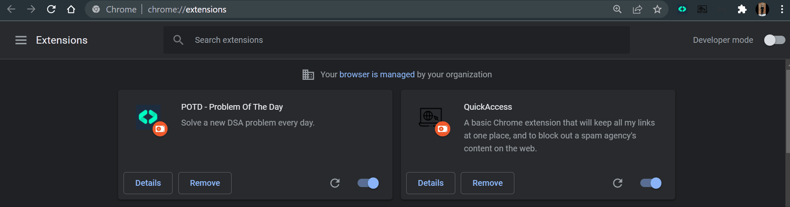

# POTD Google Chrome Extension
[](https://github.com/Hack-Repository/POTD-GoogleChromeExtension "Repo Maintained")
[](https://github.com/Hack-Repository/ "github.com/Hack-Repository")
[](https://github.com/Hack-Repository/POTD-GoogleChromeExtension "POTD")
[](https://github.com/Hack-Repository/POTD-GoogleChromeExtension/issues) 

A Google Chrome Browser extension to provide a daily practice problem on Data structures and algorithms as well as provide updates on competitive platform contest with just a click of a button.

This extension is powered by the POTD Server @**[POTD Node.js microservice](https://github.com/Hack-Repository/POTD-Node.js-microservice "POTD Server")**.
 
## Download latest Release
> Beta Release: **[Download and add to Chrome](https://github.com/Hack-Repository/POTD-UI/blob/main/README.md#Beta-Installation "Download from Github")**

## About 
The POTD service caters to bring consistency into the young budding
computer science students and enthusiasts towards DSA coding
challenges. The idea here is to provide an easy to plug chrome browser
extension to the users. Users are exposed a daily practice problem, which are from a pool
750+ problems, curated by software engineers from Google & Directi.

* The Curated selection of important coding interview questions were hand-picked from existing lists that includes but are not limited to Striver's SDE Sheet, 450 DSA Sheet, and many more.
* The extension is presently available as a beta release to generate user feedback, and is not yet available on the Chrome Store.
> Updates: v1.0.1
* **ContestsAPI**: Get Access to all upcoming global contests on platforms including **KickStart**, **Codeforces**, **AtCoder**, **Codechef**, **LeetCode** and more.
* **Bookmark Problems**: Add or remove problems from bookmarks' tab, which is baked into the extension. Revisit the daily challenges later.
* **Faster Load Time**: Optimized load times with both client-side & server-side data caching and storage. 

---
## Application Preview

#### **Extension UI:**


#### **Get Upcoming Contest Details:**


#### **Save POTD Coding Challenges as Bookmark:**


---
## Beta Installation
### System Requirement
   * Chrome Browser latest version [Download **[Here](https://www.google.com/chrome/?brand=CHBD&gclid=Cj0KCQiAuvOPBhDXARIsAKzLQ8GZY_WmaEIgK6cagEdWIdNzxyVbGzhwAREeMNvw3CuYuskT3SQEWaQaAgh-EALw_wcB&gclsrc=aw.ds "Chrome Browser")**]
   * Git [Download **[Here](https://git-scm.com/ "Git")**]
### Steps
* Install the files locally:
  ```
  git clone https://github.com/Hack-Repository/POTD-GoogleChromeExtension.git  
  ```
* Open Chrome and navigate to:
  ```
  chrome://extensions/
  ```
* Enable **Developer Mode** > Click on **Load unpacked** > **Locate** your cloned POTD folder and add to chrome.
  * > 
* Extension is now ready to use!   

---
## Application Details
[](https://github.com/Hack-Repository/POTD-GoogleChromeExtension) 


### Version
**[1.0.1 beta](https://github.com/Hack-Repository/POTD-GoogleChromeExtension "POTD CLient Version")**

### Maintainers
**[Akash Chouhan](https://github.com/akashchouhan16 "akashchouhan16")**,
**[Anurag Pratik](https://github.com/anurag-pratik "anurag-pratik")**

### License
**[MIT](https://github.com/Hack-Repository/POTD-GoogleChromeExtension/blob/main/LICENSE "License")**

All rights reserved. Copyright (c) **@akashchouhan16**
